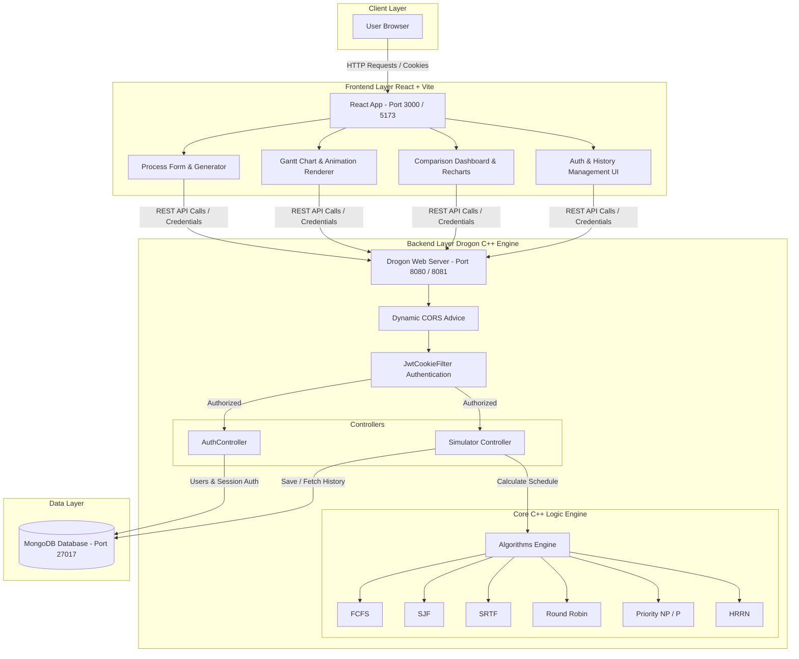
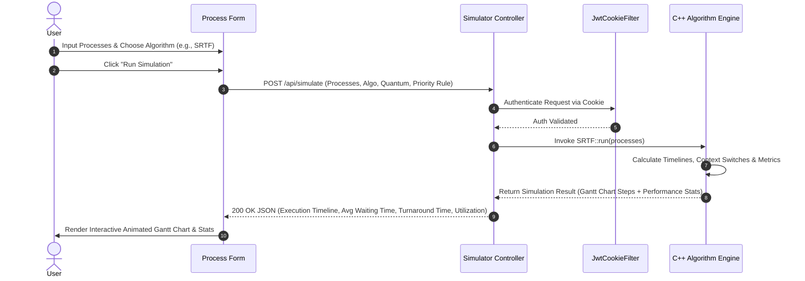
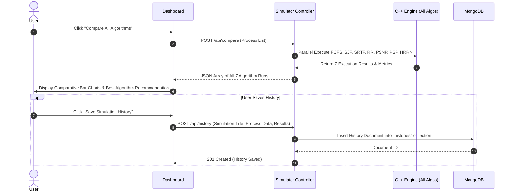

# ⚡ CPU Scheduling Visualizer

A full-stack, high-performance web application that simulates and visualizes Operating System CPU Scheduling Algorithms in real-time. Built with a modern **React + Vite** frontend and an ultra-fast **C++ Drogon web framework** backend with **MongoDB** session and history storage.


**Live Demo:** [cpu-scheduling-visualizer-bice.vercel.app](https://cpu-scheduling-visualizer-bice.vercel.app)

---

## 🌟 Key Features

- **⚡ Real-Time C++ Scheduling Engine**: All scheduling computations are computed in native C++ using the asynchronous **Drogon** web framework for sub-millisecond response times.
- **📊 7 Core OS Scheduling Algorithms**: Complete support for both preemptive and non-preemptive CPU scheduling policies.
- **🥊 Multi-Algorithm Comparison Mode**: Run all 7 algorithms in parallel against the exact same process set to visually compare CPU utilization, waiting times, turnaround times, and determine the optimal algorithm.
- **📈 Interactive Animated Gantt Chart**: Dynamic step-by-step visual representation of process execution timelines and CPU idle states.
- **🔐 JWT Authentication & Cookie Security**: Secure user login and registration powered by HttpOnly JWT cookies (with Lax/SameSite policies for development & production) and BCrypt password protection.
- **💾 Session & History Storage**: Save, review, reload, and manage historical simulation runs stored in **MongoDB**.
- **🎲 Custom & Random Process Generator**: Add custom processes with arrival times, burst times, and priorities, or generate benchmark data with a single click.

---

## ⚙️ Algorithms Supported

| Algorithm | Type | Description |
|---|---|---|
| **FCFS** (First-Come, First-Served) | Non-Preemptive | Executes processes in order of arrival. Simple, but prone to the *Convoy Effect*. |
| **SJF** (Shortest Job First) | Non-Preemptive | Selects process with smallest burst time. Minimizes average waiting time. |
| **SRTF** (Shortest Remaining Time First) | Preemptive | Preemptive version of SJF. Switches execution if a new process with shorter remaining burst arrives. |
| **Round Robin (RR)** | Preemptive | Allocates CPU to each process for a fixed *Time Quantum* before context switching. |
| **Priority (Non-Preemptive)** | Non-Preemptive | Schedules processes based on numerical priority value (high priority higher or lower configurable). |
| **Priority (Preemptive)** | Preemptive | Preempts running process if a higher-priority process arrives in the ready queue. |
| **HRRN** (Highest Response Ratio Next) | Non-Preemptive | Prevents process starvation by computing Response Ratio `$(W + B) / B$` where `$W$` is waiting time and `$B$` is burst time. |

---

## 🏗️ System Architecture

The project adopts a decoupled client-server architecture. The React frontend UI communicates with the Drogon C++ backend via CORS-enabled REST endpoints, secured by JWT cookie filters.



---

## 🔄 API Flow Diagrams

### 1. User Authentication & JWT Cookie Flow

```mermaid
sequenceDiagram
    autonumber
    actor User
    participant Frontend as React App
    participant AuthCtrl as AuthController (Drogon)
    participant Filter as JwtCookieFilter
    participant DB as MongoDB

    User->>Frontend: Submit Login / Register Form
    Frontend->>AuthCtrl: POST /register or /login (Body: email, password)
    AuthCtrl->>DB: Query User / Store Password
    DB-->>AuthCtrl: User Record Verified
    AuthCtrl->>AuthCtrl: Generate Signed JWT Token
    AuthCtrl-->>Frontend: Set-Cookie: token=<jwt>; HttpOnly; SameSite=Lax (200 OK)
    
    Note over Frontend, Filter: Subsequent Protected API Requests
    Frontend->>Filter: GET /api/check (Includes HttpOnly Cookie)
    Filter->>Filter: Verify JWT Secret & Expiry
    alt Token Valid
        Filter->>Frontend: 200 OK (Authenticated: true, User Info)
    else Token Invalid / Missing
        Filter-->>Frontend: 401 Unauthorized
    end
```

### 2. Single Simulation Calculation Flow



### 3. Multi-Algorithm Comparison & History Save Flow



---

## 🔌 API Endpoints Reference

### Authentication Endpoints

| Method | Endpoint | Description | Auth Required |
|---|---|---|---|
| `POST` | `/register` | Registers a new user account | No |
| `POST` | `/login` | Authenticates user & sets HttpOnly JWT cookie | No |
| `GET` | `/logout` | Clears authentication cookie | No |
| `GET` | `/api/check` | Validates session token & returns user info | Yes (JWT Cookie) |

### Simulator & History Endpoints

| Method | Endpoint | Description | Auth Required |
|---|---|---|---|
| `POST` | `/api/simulate` | Computes Gantt chart & metrics for a selected algorithm | Yes (JWT Cookie) |
| `POST` | `/api/compare` | Runs process set across all 7 algorithms for comparison | Yes (JWT Cookie) |
| `GET` | `/api/history` | Retrieves stored simulation history for authenticated user | Yes (JWT Cookie) |
| `POST` | `/api/history` | Saves a simulation run to history database | Yes (JWT Cookie) |
| `DELETE` | `/api/history/{id}` | Deletes a stored simulation record by ID | Yes (JWT Cookie) |

---

## 📁 Project Structure

```
Cpu-Scheduling-Visualizer/
├── Backend/                      # Drogon C++ High-Performance Backend
│   ├── controllers/              # REST Controller handlers
│   │   ├── AuthController.h/.cc   # User Auth, JWT generation & MongoDB user storage
│   │   └── Simulator.h/.cc       # Scheduling API handlers & MongoDB history
│   ├── filters/                  # Middleware Filters
│   │   └── JwtCookieFilter.cc    # JWT Cookie verification filter
│   ├── logic/                    # Core C++ Scheduling Engine
│   │   ├── process.h             # Process struct & data models
│   │   └── Algorithms/           # C++ Algorithm Implementations
│   │       ├── FCFS.cpp          # First-Come First-Served
│   │       ├── SJF.cpp           # Shortest Job First (NP)
│   │       ├── SRTF.cpp          # Shortest Remaining Time First (P)
│   │       ├── RR.cpp            # Round Robin
│   │       ├── PSNP.cpp          # Priority Scheduling (NP)
│   │       ├── PSP.cpp           # Priority Scheduling (P)
│   │       └── HRRN.cpp          # Highest Response Ratio Next
│   ├── main.cc                   # Drogon App Entry point & dynamic CORS advice
│   ├── CMakeLists.txt            # CMake build configuration
│   └── Dockerfile                # Drogon C++ container build setup
├── frontend/                     # React + Vite Modern Frontend
│   ├── src/
│   │   ├── components/           # UI Components
│   │   │   ├── ProcessForm.jsx   # Dynamic Process Entry & Generator
│   │   │   ├── GanttChart.jsx    # Interactive Timeline Visualization
│   │   │   ├── ComparisonTable.jsx# Multi-Algorithm Metric Charts
│   │   │   ├── HistoryPanel.jsx  # History Management Drawer
│   │   │   └── Navbar.jsx        # Navigation & User Profile Header
│   │   ├── pages/
│   │   │   ├── Dashboard.jsx     # Main Simulator Workspace
│   │   │   └── Auth.jsx          # Login / Registration Page
│   │   ├── app/                  # Redux state management
│   │   ├── config.js             # Dynamic API URL resolution
│   │   ├── App.jsx               # App routing & protected routes
│   │   └── main.jsx              # React Entry point
│   ├── Dockerfile                # Frontend Nginx/Vite container setup
│   └── vite.config.js            # Vite configuration
├── docker-compose.yml            # Multi-container Docker orchestration
├── .env                          # Environment variables configuration
└── README.md                     # Documentation
```

---

## 🛠️ Environment Variables

Create a `.env` file in the project root directory:

```env
# --- Database Configuration ---
MONGO_URI=mongodb://mongodb:27017
DB_NAME=scheduler_db

# --- Security & JWT ---
JWT_SECRET=your_super_secret_jwt_key_here
JWT_EXPIRY_HOURS=24
COOKIE_NAME=token

# --- Backend Server ---
PORT=8080
FRONTEND_URL=http://localhost:3000
NODE_ENV=development
```

---

## 🚀 Getting Started

### Prerequisites

- [Docker & Docker Compose](https://www.docker.com/) (Recommended)

Or for manual local installation:
- **Node.js**: v18+ and `npm`
- **C++ Compiler**: GCC/Clang with C++17 support
- **CMake**: v3.15+
- **Drogon Framework** & **mongocxx** C++ Driver installed on your system
- **MongoDB**: Local instance running on port `27017`

---

### Option 1: Docker (Recommended - Fast & Easy)

Run the full stack (Frontend, C++ Backend, MongoDB) with a single command:

```bash
# 1. Clone the repository
git clone https://github.com/KunalTechs/Cpu-Scheduling-Visualizer.git
cd Cpu-Scheduling-Visualizer

# 2. Start all services via Docker Compose
docker-compose up --build
```

#### Access Service Ports:

| Component | Container Port | Host Port | URL |
|---|---|---|---|
| **Frontend** (React) | `5173` | `3000` | `http://localhost:3000` |
| **Backend API** (Drogon C++) | `8080` | `8081` | `http://localhost:8081` |
| **Database** (MongoDB) | `27017` | `27017` | `mongodb://localhost:27017` |

To stop all services:
```bash
docker-compose down
```

---

### Option 2: Manual Local Build

#### 1. Start MongoDB
Ensure MongoDB service is running locally on port `27017`.

#### 2. Build & Run C++ Drogon Backend
```bash
cd Backend
mkdir build && cd build
cmake ..
make -j$(nproc)
./scheduling_backend
```
*The Drogon REST API server will listen on `http://localhost:8080`.*

#### 3. Run React Frontend
```bash
cd frontend
npm install
npm run dev
```
*The Vite development server will open at `http://localhost:5173`.*

---

## 💡 How to Use the Simulator

1. **Register / Log In**: Create an account to enable simulation history saving.
2. **Add Processes**:
   - Manually enter **Process ID**, **Arrival Time**, **Burst Time**, and **Priority**.
   - Click **"Randomize"** to generate benchmark workload data instantly.
3. **Select Algorithm & Settings**:
   - Choose one of the 7 scheduling algorithms.
   - For **Round Robin**, set the **Time Quantum**.
   - Toggle priority logic (Lower number = Higher Priority or vice versa).
4. **Run Simulation**: Click **"Run Simulation"** to compute and render the animated **Gantt Chart**, execution metrics, waiting times, and CPU utilization.
5. **Compare All Algorithms**: Click **"Compare All"** to execute all 7 algorithms simultaneously and view side-by-side comparative charts.
6. **Save to History**: Save your workload and results to your account history to reload or review anytime.

---

## 🤝 Contributing

Contributions, issues, and feature requests are welcome! Feel free to check the issues page or submit a pull request.

1. Fork the Project
2. Create your Feature Branch (`git checkout -b feature/AmazingFeature`)
3. Commit your Changes (`git commit -m 'Add some AmazingFeature'`)
4. Push to the Branch (`git push origin feature/AmazingFeature`)
5. Open a Pull Request

---

## 👨‍💻 Author

**Kunal**
- GitHub: [@KunalTechs](https://github.com/KunalTechs)
- Live App: [CPU Scheduling Visualizer](https://cpu-scheduling-visualizer-bice.vercel.app)

---

⭐ **If you find this project useful, please consider giving it a star on GitHub!**
